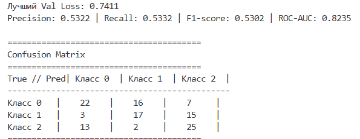
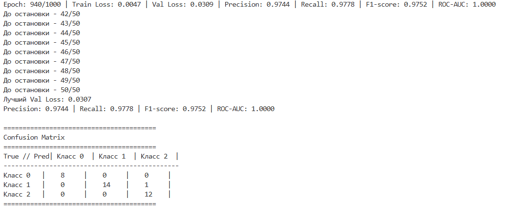
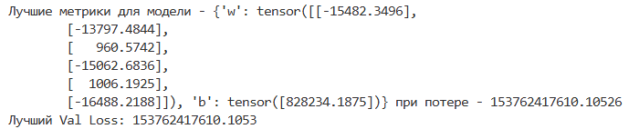
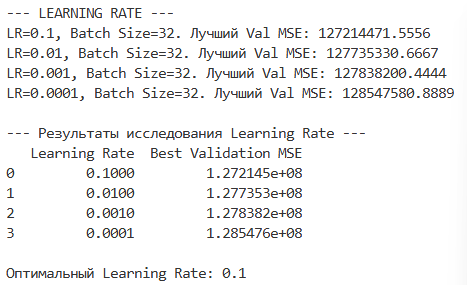
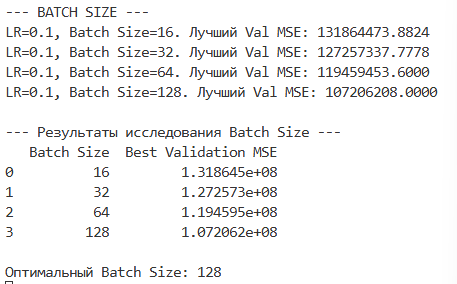
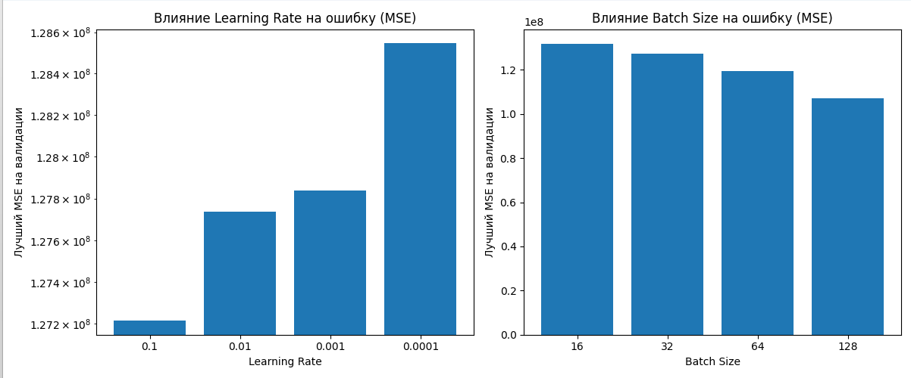

# Домашнее задание к уроку 2: Линейная и логистическая регрессия

## Задание 1: Модификация существующих моделей 
### 1.1 Расширение линейной регрессии 
```python
# Модифицируйте существующую линейную регрессию:
# - Добавьте L1 и L2 регуляризацию
class LinearRegressionManualWithReg:
    def __init__(self, in_features, L1 = 0.0, L2 = 0.0):
        self.w = torch.randn(in_features, 1, dtype=torch.float32, requires_grad=False)
        self.b = torch.zeros(1, dtype=torch.float32, requires_grad=False)
        self.l1 = L1
        self.l2 = L2
    def backward(self, X, y, y_pred):
            n = X.shape[0]
            error = y_pred - y

            mse_dw = (X.T @ error) / n
            mse_db = error.mean(0)
            
            l2_dw = 2 * self.l2 * self.w    #Производная от L2, или же градиент
            l1_dw = self.l1 * torch.sign(self.w)  #Производная от L1

            self.dw = mse_dw + l2_dw + l1_dw
            self.db = mse_db
# - Добавьте early stopping
class EarlyStopper:
    def __init__(self, patience=5, min_delta=0.0):
        """
        patience (int): Сколько эпох ждать улучшения, перед остановкой
        min_delta (float): Минимальное изменение, которое считается улучшением
        """
        self.patience = patience
        self.min_delta = min_delta
        self.counter = 0
        self.best_loss = float('inf')
        self.best_model_state = None

    def __call__(self, val_loss, model):
        """
        val_loss (float): Ошибка за данную эпоху
        """
        if val_loss < self.best_loss - self.min_delta:
            self.best_loss = val_loss
            self.counter = 0
            # Сохраняем лучшую модель
            self.best_model_state = model.parameters()
            print(f"Наименьший loss - {self.best_loss:.4f}")
        else:
            self.counter += 1
            print(f"До остановки - {self.counter}/{self.patience}")
        
        if self.counter >= self.patience:
            return True
        return False
```

### 1.2 Расширение логистической регрессии 
```python
# Модифицируйте существующую логистическую регрессию:
# - Добавьте поддержку многоклассовой классификации
import torch.nn.functional as F

class SoftmaxRegressionManual:
    def __init__(self, in_features, num_classes):
        self.w = torch.randn(in_features, num_classes, dtype=torch.float32, requires_grad=False)
        self.b = torch.zeros(1, num_classes, dtype=torch.float32, requires_grad=False)
        self.num_classes = num_classes

    def __call__(self, X):
        logits = X @ self.w + self.b
        return softmax(logits)

    def parameters(self):
        return [self.w, self.b]

    def zero_grad(self):
        self.dw = torch.zeros_like(self.w)
        self.db = torch.zeros_like(self.b)

    def backward(self, X, y, y_pred):
        n = X.shape[0]
        y_one_hot = F.one_hot(y, num_classes=self.num_classes).to(torch.float32)
        error = y_pred - y_one_hot
        self.dw = (X.T @ error) / n
        self.db = error.mean(0)

    def step(self, lr):
        self.w -= lr * self.dw
        self.b -= lr * self.db

    def save(self, path):
        torch.save({'w': self.w, 'b': self.b}, path)

    def load(self, path):
        state = torch.load(path)
        self.w = state['w']
        self.b = state['b']

def softmax(x):  # Нормализуем тензор чтобы в сумме каждая строчка давала 1
    exps = torch.exp(x - torch.max(x, dim=1, keepdim=True).values)
    return exps / torch.sum(exps, dim=1, keepdim=True)

# - Реализуйте метрики: precision, recall, F1-score, ROC-AUC
def precision_recall_f1(y_true, y_pred, num_classes):

    precisions = []
    recalls = []
    f1s = []
    epsilon = 1e-7 

    for i in range(num_classes):
        #  i - "позитивный"
        tp = ((y_pred == i) & (y_true == i)).sum().item()
        fp = ((y_pred == i) & (y_true != i)).sum().item()
        fn = ((y_pred != i) & (y_true == i)).sum().item()

        precision = tp / (tp + fp + epsilon)
        recall = tp / (tp + fn + epsilon)
        f1 = 2 * (precision * recall) / (precision + recall + epsilon)
        
        precisions.append(precision)
        recalls.append(recall)
        f1s.append(f1)

    precision = sum(precisions) / num_classes
    recall = sum(recalls) / num_classes
    f1 = sum(f1s) / num_classes
    return precision, recall, f1

def roc_auc_score_manual(y_true, y_scores, num_classes):
    aucs = []
    for i in range(num_classes):
        y_true_binary = (y_true == i).float()
        # Берем вероятности для текущего класса
        y_scores_binary = y_scores[:, i]
        
        # Отделяем оценки для позитивных и негативных классов
        pos_mask = y_true_binary == 1
        neg_mask = y_true_binary == 0
        
        pos_scores = y_scores_binary[pos_mask]
        neg_scores = y_scores_binary[neg_mask]
        #Если нет данных класса, то переходим к следующему классу
        if pos_scores.numel() == 0 or neg_scores.numel() == 0:
            continue

        num_correct_pairs = (pos_scores.unsqueeze(1) > neg_scores.unsqueeze(0)).sum()
        num_tied_pairs = (pos_scores.unsqueeze(1) == neg_scores.unsqueeze(0)).sum()
        total_pairs = pos_scores.numel() * neg_scores.numel()
        
        #Считаем
        auc = (num_correct_pairs + 0.5 * num_tied_pairs) / total_pairs
        aucs.append(auc)
    if not aucs:
        return 0.0
    macro_auc = torch.stack(aucs).mean()
    
    return macro_auc.item()

# - Добавьте визуализацию confusion matrix
def plot_confusion_matrix_text(y_true, y_pred, num_classes):

    conf_matrix = torch.zeros((num_classes, num_classes), dtype=torch.int64)
    for t, p in zip(y_true, y_pred):
        conf_matrix[t, p] += 1
    
    print("\n" + "="*40)
    print("Confusion Matrix")
    print("="*40)

    header = f"{'True // Pred':<10}|"
    for i in range(num_classes):
        header += f"{'Класс ' + str(i):^10}|"
    print(header)
    print("-" * len(header))
    
    for i in range(num_classes):
        row_str = f"{'Класс ' + str(i):<10}|"
        for j in range(num_classes):
            count = conf_matrix[i, j].item()
            row_str += f"{str(count):^10}|"
        print(row_str)
    print("="*40 + "\n")

```
#### После выполнения проверки на рандомно созданном датасете в виде спирали получились такие данные:


## Задание 2: Работа с датасетами

### 2.1 Кастомный Dataset класс
```python
# Создайте кастомный класс датасета для работы с CSV файлами:
# - Загрузка данных из файла
# - Предобработка (нормализация, кодирование категорий)
# - Поддержка различных форматов данных (категориальные, числовые, бинарные и т.д.)
class CustomCsvDataset(Dataset):
    """
    Args:
        csv_path (str): Путь к CSV файлу
        target_col (str): Название колонки с целевой переменной(y)
        numerical_cols (list): Список названий числовых колонок
        categorical_cols (list): Список названий категориальных колонок
    """
    def __init__(self, csv_path, target_col, numerical_cols, categorical_cols = None, head = None):
# - Загрузка данных из файла
        df = pd.read_csv(csv_path, header=head)
        if not df.empty:
            print('Файл прочитан успешно')
        else:
            print('Файл не прочитан')
        if numerical_cols:    
            for col in numerical_cols:
                df[col] = df[col].fillna(df[col].mean())
        if categorical_cols:
            for col in categorical_cols:
                df[col] = df[col].fillna(df[col].mode()[0])
        
        # Разделение на признаки (X) и цель (y)
        X = df.drop(columns=[target_col])
        y = df[target_col]

        processed_features = []
        if numerical_cols:
            scaler = StandardScaler()
            # Нормализуем и добавляем в список обработанных признаков
            num_features = pd.DataFrame(scaler.fit_transform(X[numerical_cols]), columns=numerical_cols)
            processed_features.append(num_features)
            
        # Обработка категориальных признаков 
        if categorical_cols:
            cat_features = pd.get_dummies(X[categorical_cols], drop_first=True)
            processed_features.append(cat_features)

        # Объединяем обработанные числовые и категориальные признаки
        if processed_features:
            X_processed = pd.concat(processed_features, axis=1)
        else:
            print('Error')

        self.X = torch.tensor(X_processed.values, dtype=torch.float32)
        self.y = torch.tensor((y.values), dtype=torch.float32).unsqueeze(1)
        # для первого датасета
        # self.y = torch.tensor((y.values - 1), dtype=torch.long)
    def __len__(self):
        return len(self.X)

    def __getitem__(self, idx):
        return self.X[idx], self.y[idx]
```

### 2.2 Эксперименты с различными датасетами
```python
# Найдите csv датасеты для регрессии и бинарной классификации и, применяя наработки из предыдущей части задания, обучите линейную и логистическую регрессию
from homework_model_modification import accuracy, random_split,DataLoader,SoftmaxRegressionManual,EarlyStopper, cross_entropy_loss,precision_recall_f1,plot_confusion_matrix_text,roc_auc_score_manual,log_epoch


# Обучение многоклассовой классификации на датаесете вин
'''
if __name__ == '__main__':
    dataset_cst = CustomCsvDataset("data/wine.csv",0,[1,2,3,4,5,6,7,8,9,10,11,12,13])
    NUM_FEATURES = 13
    NUM_CLASSES = 3

    val_split = 0.2
    val_size = int(len(dataset_cst) * val_split)
    train_size = len(dataset_cst) - val_size
    train_dataset, val_dataset = random_split(dataset_cst, [train_size, val_size])

    train_dataloader = DataLoader(train_dataset, batch_size=32, shuffle=True)
    val_dataloader = DataLoader(val_dataset, batch_size=32, shuffle=False) 

    print(f'train_size: {len(train_dataset)} | val_size: {len(val_dataset)}')
    print(f'train_batches: {len(train_dataloader)} | val_batches: {len(val_dataloader)}')
    
    model = SoftmaxRegressionManual(in_features=NUM_FEATURES, num_classes=NUM_CLASSES)
    lr = 0.1
    epochs = 1000
    stopper = EarlyStopper(patience=50)

    for epoch in range(1, epochs + 1):
        train_loss_history = []
        for batch_X, batch_y in train_dataloader:
            y_pred = model(batch_X)
            loss = cross_entropy_loss(y_pred, batch_y, NUM_CLASSES)
            train_loss_history.append(loss.item())
            
            model.zero_grad()
            model.backward(batch_X, batch_y, y_pred)
            model.step(lr)
        
        avg_train_loss = sum(train_loss_history) / len(train_loss_history)
        
        val_loss_history = []
        all_y_true = []
        all_y_pred_probs = []

        for batch_X_val, batch_y_val in val_dataloader:
            y_pred_probs_val = model(batch_X_val)
            val_loss = cross_entropy_loss(y_pred_probs_val, batch_y_val, NUM_CLASSES)
            val_loss_history.append(val_loss.item())
            
            all_y_true.append(batch_y_val)
            all_y_pred_probs.append(y_pred_probs_val)

        avg_val_loss = sum(val_loss_history) / len(val_loss_history)
        
        all_y_true = torch.cat(all_y_true)
        all_y_pred_probs = torch.cat(all_y_pred_probs)
        all_y_pred_labels = torch.argmax(all_y_pred_probs, dim=1)
        
        # Считаем метрики
        precision, recall, f1 = precision_recall_f1(all_y_true, all_y_pred_labels, NUM_CLASSES)
        roc_auc = roc_auc_score_manual(all_y_true, all_y_pred_probs, NUM_CLASSES)
        
        metrics = {'Precision': precision, 'Recall': recall, 'F1-score': f1, 'ROC-AUC': roc_auc}
        
        if epoch % 10 == 0 or epoch == 1:
            log_epoch(epoch, epochs=epochs, train_loss=avg_train_loss, val_loss=avg_val_loss, metrics=metrics)

        if stopper(avg_val_loss, model):
            break

    # Восстанавливаем лучшую модель
    if stopper.best_model_state:
        model.w = stopper.best_model_state['w']
        model.b = stopper.best_model_state['b']
        print(f'Лучший Val Loss: {stopper.best_loss:.4f}')

    model.save('softmax_reg_manual.pth') 
    
    # Пересчитываем предсказания с лучшей моделью
    final_y_true = []
    final_y_pred_probs = []
    for batch_X_val, batch_y_val in val_dataloader:
        final_y_pred_probs.append(model(batch_X_val))
        final_y_true.append(batch_y_val)

    final_y_true = torch.cat(final_y_true)
    final_y_pred_probs = torch.cat(final_y_pred_probs)
    final_y_pred_labels = torch.argmax(final_y_pred_probs, dim=1)

    # Выводим
    precision, recall, f1 = precision_recall_f1(final_y_true, final_y_pred_labels, NUM_CLASSES)
    roc_auc = roc_auc_score_manual(final_y_true, final_y_pred_probs, NUM_CLASSES)
    
    print(f"Precision: {precision:.4f} | Recall: {recall:.4f} | F1-score: {f1:.4f} | ROC-AUC: {roc_auc:.4f}")

    plot_confusion_matrix_text(final_y_true, final_y_pred_labels, num_classes=NUM_CLASSES)
    print(f'accuracy = {accuracy(final_y_pred_probs, final_y_true)}')
'''


# Обучение линейной регрессии на датасете цен американских домов
from homework_model_modification import LinearRegressionManualWithReg, mse
from homework_model_modification import LinearRegressionManual


if __name__ == '__main__':
    """ Очистили датасет от нечисленных метрик
    def clean_housing_data(csv_path):
        df = pd.read_csv(csv_path)
        
        # Удаляем ненужные колонки
        cols_to_drop = ['Address', 'MLS ID', 'Listing Agent', 'Status', 'Listing URL', 'Zipcode']
        df.drop(columns=cols_to_drop, inplace=True)
        
        # Очищаем 
        # Цена (целевая переменная)
        df['Price'] = df['Price'].replace({'\$': '', ',': ''}, regex=True).astype(float)
        # Спальни
        df['Bedrooms'] = df['Bedrooms'].str.replace(' bds', '').astype(int)
        # Ванные
        df['Bathrooms'] = df['Bathrooms'].str.replace(' ba', '').astype(int)
        # Площадь дома
        df['Area (Sqft)'] = df['Area (Sqft)'].str.replace(' sqft', '').astype(int)
        # Площадь участка
        df['Lot Size'] = df['Lot Size'].str.replace(' sqft', '').astype(int)
        # Переименуем колонку для удобства
        df.rename(columns={'Area (Sqft)': 'Area_Sqft'}, inplace=True)

        print("Датасет после очистки:")
        print(df.head())
        print("\nТипы данных после очистки:")
        print(df.info())
        
        return df
    HOUSING_CSV_PATH = 'data/us_house_Sales_data.csv'
    cleaned_df = clean_housing_data(HOUSING_CSV_PATH)
    CLEANED_HOUSING_PATH = 'data/us_house_sales_cleaned.csv'
    cleaned_df.to_csv(CLEANED_HOUSING_PATH, index=False)
"""
    
    num_columns = [
        'Bedrooms', 
        'Bathrooms', 
        'Area_Sqft', 
        'Lot Size', 
        'Year Built', 
        'Days on Market'
    ]
    dataset_cst = CustomCsvDataset("data/us_house_sales_cleaned.csv",'Price',num_columns, head=0)
    
    val_split = 0.2
    val_size = int(len(dataset_cst) * val_split)
    train_size = len(dataset_cst) - val_size
    train_dataset, val_dataset = random_split(dataset_cst, [train_size, val_size])

    train_dataloader = DataLoader(train_dataset, batch_size=32, shuffle=True)
    val_dataloader = DataLoader(val_dataset, batch_size=32, shuffle=False) 

    print(f'train_size: {len(train_dataset)} | val_size: {len(val_dataset)}')
    print(f'train_batches: {len(train_dataloader)} | val_batches: {len(val_dataloader)}')
    
    # Обучаем модель
    
    model = LinearRegressionManual(in_features=len(num_columns))
    lr = 0.1
    epochs = 5000
    stopper = EarlyStopper(10000)

    for epoch in range(1, epochs + 1):
        train_loss_history = []
        
        for i, (batch_X, batch_y) in enumerate(train_dataloader):
            y_pred = model(batch_X)
            loss = mse(y_pred, batch_y)
            train_loss_history.append(loss)
            
            model.zero_grad()
            model.backward(batch_X, batch_y, y_pred)
            model.step(lr)
        
        avg_train_loss = sum(train_loss_history) / len(train_loss_history)
        
        val_loss_history = []
        for batch_X_val, batch_y_val in val_dataloader:
            y_pred_val = model(batch_X_val)
            val_loss = mse(y_pred_val, batch_y_val)
            val_loss_history.append(val_loss)
        avg_val_loss = sum(val_loss_history) / len(val_loss_history)
        
        if epoch % 10 == 0:
            log_epoch(epoch,epochs, train_loss=avg_train_loss, val_loss=avg_val_loss)

        if stopper(avg_val_loss,model):
            break

    if stopper.best_model_state:
        model.w = stopper.best_model_state['w']
        model.b = stopper.best_model_state['b']

    print(f'Лучшие метрики для модели - {stopper.best_model_state} при потере - {stopper.best_loss}')

    model.save('linreg_manual.pth') 

    if stopper.best_model_state:
        model.w = stopper.best_model_state['w']
        model.b = stopper.best_model_state['b']
        print(f'Лучший Val Loss: {stopper.best_loss:.4f}')
```
#### На датасете вин проверил логистическую регрессию и получил минимальные потери 0.03, и хорошее классифицирование

#### А после обучения на датасете с ценами домов получилось не очень хорошо, скорее всего численных метрик мало для оценки, ведь я очистил половину датасета


## Задание 3: Эксперименты и анализ 

### 3.1 Исследование гиперпараметров 
```python
# Проведите эксперименты с различными:
# - Скоростями обучения (learning rate)

# - Размерами батчей

# - Оптимизаторами (SGD, Adam, RMSprop)
# Визуализируйте результаты в виде графиков или таблиц

```

### 3.2 Feature Engineering
```python
# Создайте новые признаки для улучшения модели:
# - Полиномиальные признаки
# - Взаимодействия между признаками
# - Статистические признаки (среднее, дисперсия)
# Сравните качество с базовой моделью
```

## Дополнительные требования

1. **Код должен быть модульным** - разделите на функции и классы
2. **Документация** - добавьте подробные комментарии и docstring
3. **Визуализация** - создайте графики для анализа результатов
4. **Тестирование** - добавьте unit-тесты для критических функций
5. **Логирование** - используйте logging для отслеживания процесса обучения