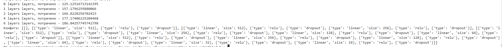
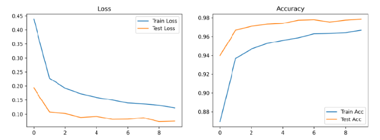
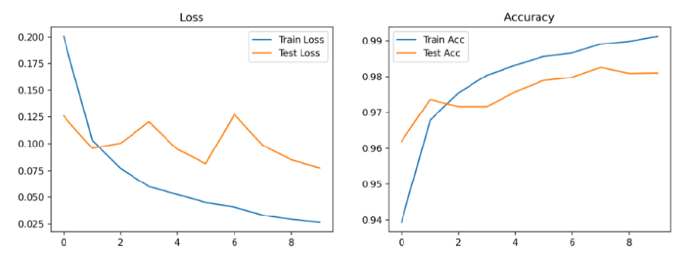
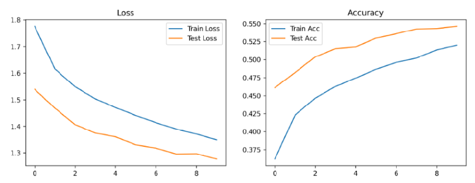
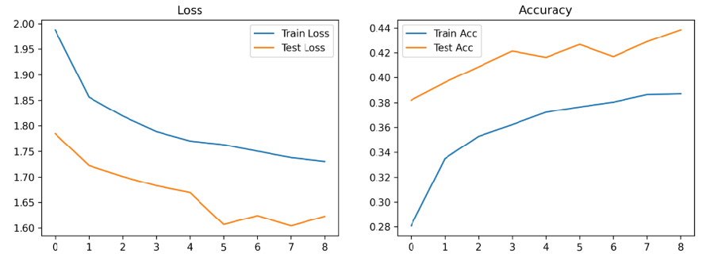
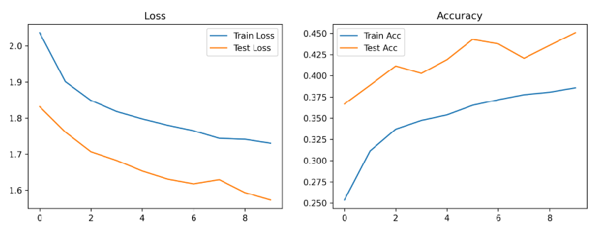
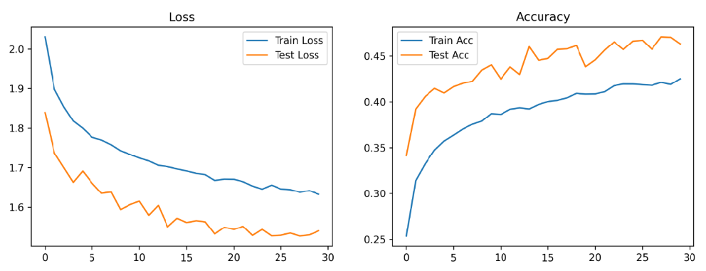
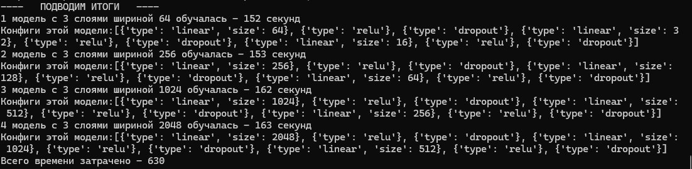

# Домашнее задание к уроку 3: Полносвязные сети

## Задание 1: Эксперименты с глубиной сети 
### 1.1 Сравнение моделей разной глубины 
```python
# Создайте и обучите модели с различным количеством слоев:
# - 1 слой (линейный классификатор)
# - 2 слоя (1 скрытый)
# - 3 слоя (2 скрытых)
# - 5 слоев (4 скрытых)
# - 7 слоев (6 скрытых)
from time import time
from utils.model_utils import FullyConnectedModel, train_model, count_parameters
from utils.visualization_utils import plot_training_history, get_mnist_loaders
import torch


def create_layer_config(num_hidden_layers: int, start_size: int = 512):
    """
    Генерирует конфигурацию для скрытых слоев модели
    """
    config = []
    if num_hidden_layers == 0:
        return []

    current_size = start_size
    for i in range(num_hidden_layers):
        config.append({"type": "linear", "size": current_size})
        config.append({"type": "relu"})
        if i != num_hidden_layers:
            config.append({"type": "dropout"})
        current_size //= 2 
    return config

if __name__ == '__main__':
    
    
    layers = [0,1,2,4,6]
    times = {}
    history_config = []
    for layer in layers:
        device = torch.device('cuda' if torch.cuda.is_available() else 'cpu')
        train_loader, test_loader = get_mnist_loaders(batch_size=64)
        
        name = f'{layer} layers'
        config = create_layer_config(layer)
        model = FullyConnectedModel(
            input_size=784,
            num_classes=10,
            layers=config
        ).to(device)

        print(f"Model parameters: {count_parameters(model)}")

        t1 = time()
        history = train_model(model, train_loader, test_loader, epochs=10, device=str(device),name=name)
        plot_training_history(history,name) 
        t2 = time()
        times[name] = t2-t1
        print(f'Потрачено времени на {layer} обучение - {(t2-t1)}с')
        history_config.append(config)
    for layer, time in times.items():
        print(f'{layer} layers, потрачено - {time}')
    print(f'Конфиги: {history_config}')


# Для каждого варианта:
# - Сравните точность на train и test
На валидационных данных точность всегда выше, даже если немного
# - Визуализируйте кривые обучения
Все графики метрик в plots/
# - Проанализируйте время обучения
```
С каждой моделью время увеличивается линейно для обучения, все кривые обучения в папке plots/



### 1.2 Анализ переобучения 
```python
# Исследуйте влияние глубины на переобучение:
# - Постройте графики train/test accuracy по эпохам
# - Определите оптимальную глубину для каждого датасета
# - Добавьте Dropout и BatchNorm, сравните результаты
# - Проанализируйте, когда начинается переобучение
```
#### mnist:
- можно рассмотреть данные с 6 моделями от 1 до 6 слоев с Dropout и заметить, что после 3 слоя метрикии начинают падать, поэтому для модели с Dropout лучше всего будет 3 слоя 8-10 эпох, потому что далее точность уже не растет
 
- можно рассмотреть данные с 6 моделями от 1 до 6 слоев с Barchnorm и заметить, слои схожи, но лучшая точность была на 3 слоях, и 8 эпох достаточно, потому что далее точность начинает падать(воможно далее будет рост, тк лосс не росс после 8 эпохи), также на всех моделях тестовые данные, а именно точность на них меньше чем на обучаемых. Также можно заметить что с каждым слоем тестовая точность приближается к обучаемой и то же самое с лоссом, могу предположить что большее колво слоев может увеличить точность, но я не смогу проверить из-за долго времени обучения

#### cifar
- Используя Dropout и Batchnorm получилось так что 2 слоя были самыми точными, а после этого все хуже и хуже
Все данные(плоты и метрики лежат в папках plots/ и results/ соотвествтенно), переобучение на моем количестве эпох не начиналось, очень мало для подобного датасета
 
- Используя только Dropout получилось что самое точное было 3 слоя и судя по графику оно бы пошло и дальше обучаться если бы было больше эпох, переобучения заметно не было



## Задание 2: Эксперименты с шириной сети 

Создайте файл `homework_width_experiments.py`:

### 2.1 Сравнение моделей разной ширины 
```python
# Создайте модели с различной шириной слоев:
# - Узкие слои: [64, 32, 16]
# - Средние слои: [256, 128, 64]
# - Широкие слои: [1024, 512, 256]
# - Очень широкие слои: [2048, 1024, 512]
# 
# Для каждого варианта:
# - Поддерживайте одинаковую глубину (3 слоя)
# - Сравните точность и время обучения
# - Проанализируйте количество параметров
```
Самая лучшая точность на слоях [256, 128, 64], потом же точность падала и падала, также не видно что модель переобучается, значит можно было бы опробовать большое колво эпох

Я добавил 30 эпох, можем наблюдать что и вправду обучение продолжилось по точности, будет ли переобучение? неизвестно



С каждым добавлением ширины слоев, время обучения увеличивалось, но не особо сильно как это было видно в увеличении колва слоев


Колво параметров:
64:

256:

1024:

2048:


### 2.2 Оптимизация архитектуры (10 баллов)
```python
# Найдите оптимальную архитектуру:
# - Используйте grid search для поиска лучшей комбинации
# - Попробуйте различные схемы изменения ширины (расширение, сужение, постоянная)
# - Визуализируйте результаты в виде heatmap
```
## Задание 3: Эксперименты с регуляризацией (25 баллов)

Создайте файл `homework_regularization_experiments.py`:

### 3.1 Сравнение техник регуляризации (15 баллов)
```python
# Исследуйте различные техники регуляризации:
# - Без регуляризации
# - Только Dropout (разные коэффициенты: 0.1, 0.3, 0.5)
# - Только BatchNorm
# - Dropout + BatchNorm
# - L2 регуляризация (weight decay)
# 
# Для каждого варианта:
# - Используйте одинаковую архитектуру
# - Сравните финальную точность
# - Проанализируйте стабильность обучения
# - Визуализируйте распределение весов
```

### 3.2 Адаптивная регуляризация (10 баллов)
```python
# Реализуйте адаптивные техники:
# - Dropout с изменяющимся коэффициентом
# - BatchNorm с различными momentum
# - Комбинирование нескольких техник
# - Анализ влияния на разные слои сети
```

## Структура проекта

```
homework/
├── homework_depth_experiments.py
├── homework_width_experiments.py
├── homework_regularization_experiments.py
├── utils/
│   ├── experiment_utils.py
│   ├── visualization_utils.py
│   └── model_utils.py
├── results/
│   ├── depth_experiments/
│   ├── width_experiments/
│   └── regularization_experiments/
├── plots/                   # Графики и визуализации
└── README.md               # Описание результатов
```